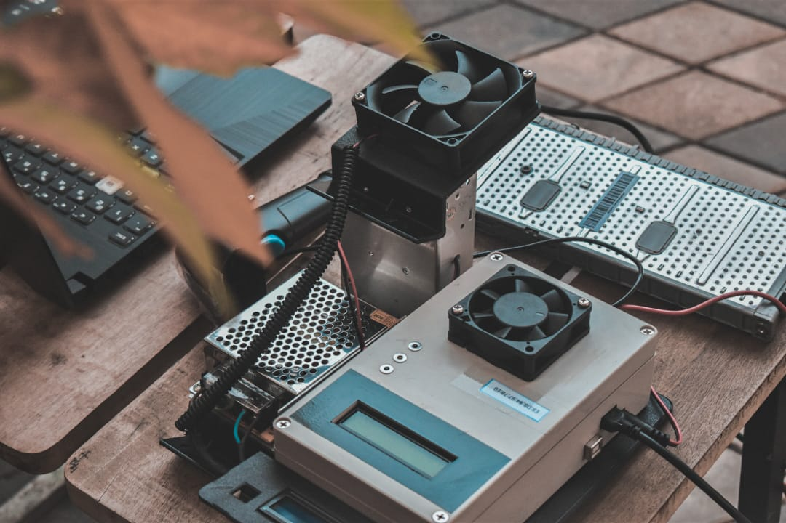

      <h1>Hi  I'm Minija Migara</h1> 

I am a Software application developer,from Sri Lanka. I’ve always been a   
great problem solver, an independent introvert, and a technophile obsessed with the latest technologies. 
I’m familiar with a variety of programming languages, including JavaScript, HTML, CSS, Xamarin,  
Android, jQuery, C#, Arduino and Java, but I’m always adding new skills to my repertoire.

### 🔗 Connect with me

  
  
  
  
  

---

### 🧰 Technologies & Tools

  

    
    
    
    
    
    
    
    
    
    
    
    
    
    
    
    
    
    
    
  

  

    
    
    
    
    
    
    
  

### 🌸 My products
<table cellpadding="0" cellspacing="0" border="0">
  <tr>
    <th>Hybrid Battery Health Diagnostic System</th>
    <th>Automated Gardning System</th>
    <th>Smart Timer Controller</th>
  </tr>
  <tr>
    <th></th>
    <th></th>
    <th></th>
  </tr>
  <tr>
    <th>
<a href="">↗️... More Info</a>
</th>
    <th>
<a href="https://www.facebook.com/commerce/products/3575602082463312/">↗️... More Info</a>
</td>
    <th>
<a href="https://www.facebook.com/commerce/products/4817797844958353/">↗️... More Info</a>
</td>
  </tr>
</table>

---
### 📹 Latest YouTube videos

<!-- Youtube-video-List:START-->

<!-- Youtube-video-List:END-->

↗️[... More YouTube Videos](https://www.youtube.com/c/Intellipaat)

---
### 📕 Latest Blogs

<!-- Blogs-List:START-->

<!-- Blogs-List:END-->

↗️[... More Blogs](https://www.youtube.com/c/Intellipaat)

---
### ✨ My Bussiness Profiles

<!--
**minijamigara/minijamigara** is a ✨ _special_ ✨ repository because its `README.md` (this file) appears on your GitHub profile.

Here are some ideas to get you started:

- 🔭 I’m currently working on ...
- 🌱 I’m currently learning ...
- 👯 I’m looking to collaborate on ...
- 🤔 I’m looking for help with ...
- 💬 Ask me about ...
- 📫 How to reach me: ...
- 😄 Pronouns: ...
- ⚡ Fun fact: ...
-->
